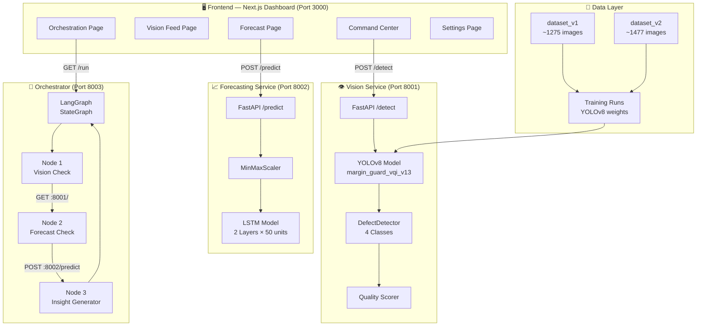
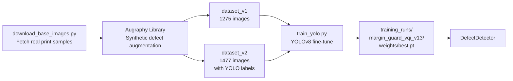
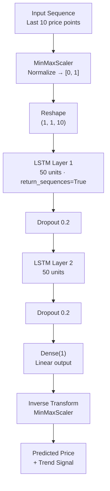
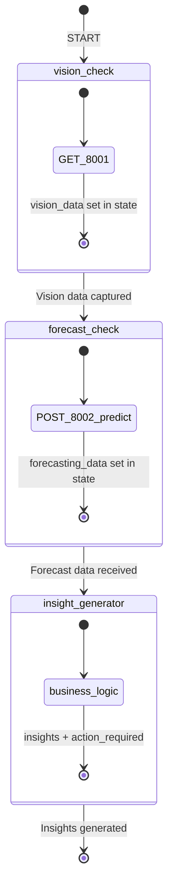
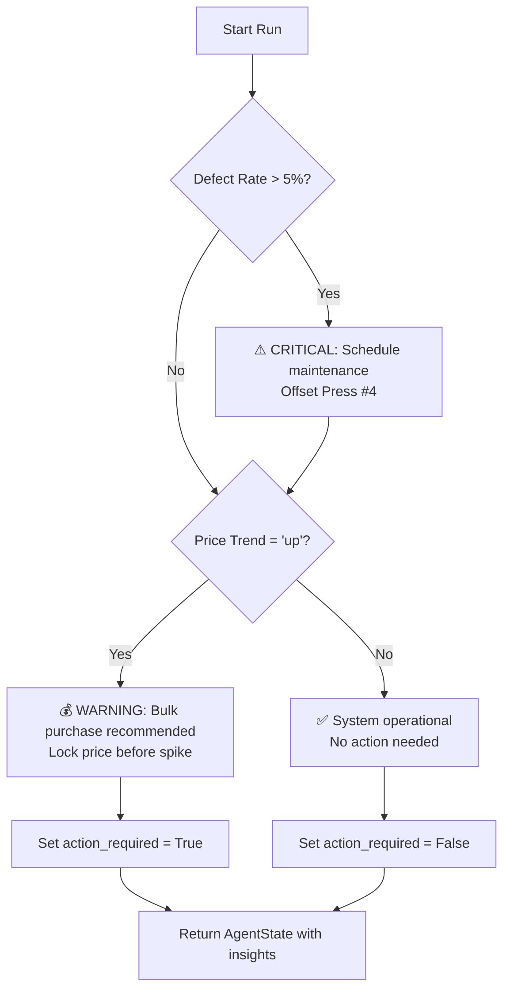
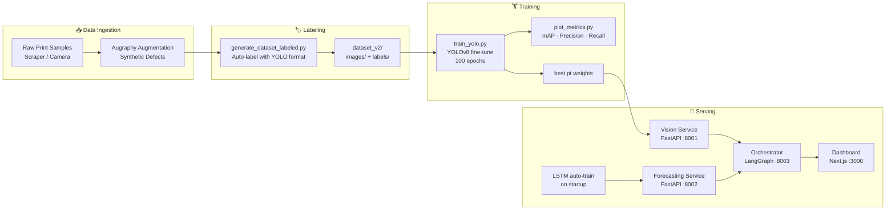
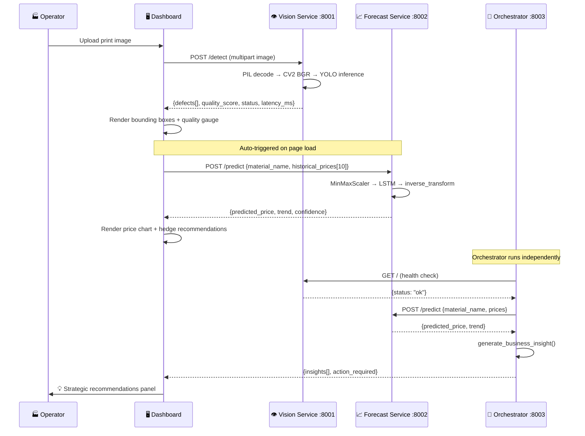

# 🖨️ NeuroPress — Industrial Printing Intelligence Platform

<div align="center">


**An end-to-end AI-powered quality control and operational intelligence platform for the printing and packaging industry.**

[🚀 Live Dashboard](https://neuropress-ai-dashboard.onrender.com) · [📂 GitHub](https://github.com/ankushsingh003/Waste-Management)

</div>

---

## 📋 Table of Contents

1. [Project Overview](#-project-overview)
2. [Key Features](#-key-features)
3. [System Architecture](#-system-architecture)
4. [AI Models Explained](#-ai-models-explained)
   - [Vision Agent — YOLOv8 Defect Detector](#1-vision-agent--yolov8-defect-detector)
   - [Forecasting Agent — LSTM Price Predictor](#2-forecasting-agent--lstm-price-predictor)
   - [Orchestrator — LangGraph Decision Engine](#3-orchestrator--langgraph-decision-engine)
5. [Data Pipeline](#-data-pipeline)
6. [Full Workflow Diagram](#-full-workflow-diagram)
7. [Project Structure](#-project-structure)
8. [API Reference](#-api-reference)
9. [Dashboard Pages](#-dashboard-pages)
10. [Running Locally](#-running-locally)
11. [Deployment (Render)](#-deployment-render)
12. [Technology Stack](#-technology-stack)

---

## 🧠 Project Overview

**NeuroPress** is a multi-agent AI platform designed specifically for the **printing and packaging industry**. It solves three core operational challenges that printing companies face every day:

| Problem | NeuroPress Solution |
|---------|----------------------|
| 🔴 **Manual quality inspection** — slow, inconsistent, expensive | ✅ YOLOv8 visual AI inspects every print in real-time at <50ms latency |
| 🔴 **Reactive supply chain** — buying raw materials when prices spike | ✅ LSTM model forecasts paper/ink/material prices 5 weeks ahead |
| 🔴 **Siloed data** — vision and market data never combined | ✅ LangGraph orchestrator fuses both signals into executable business decisions |

The platform runs three independent **microservices** coordinated by a **LangGraph multi-agent graph**, all monitored from a single **Next.js enterprise dashboard**.

---

## ✨ Key Features

- 🎯 **Real-time Defect Detection** — 4 defect classes: `misprint`, `ink_bleed`, `substrate_tear`, `contamination`
- 💰 **AI Price Forecasting** — 5-week ahead predictions for Paper, Ink, Aluminum, PET Film
- 🧩 **Multi-Agent Orchestration** — LangGraph fuses vision + market data → strategic decisions
- 📊 **Live Enterprise Dashboard** — 5 pages: Command Center, Vision, Forecast, Orchestration, Settings
- 🏭 **Multi-Facility Support** — Chicago, Berlin, Tokyo facility switching
- 🔄 **Autonomous Hedge Engine** — auto-recommends bulk purchases when material prices trend upward
- ⚡ **Sub-50ms Inference** — YOLOv8 optimized for industrial throughput
- 🌍 **Cloud Deployed** — Render.com with GitHub auto-deploy

---

## 🏗️ System Architecture



---

## 🤖 AI Models Explained

### 1. Vision Agent — YOLOv8 Defect Detector

**File:** `vision_service/detector.py`

The core visual quality inspection engine. Uses a **fine-tuned YOLOv8n** (nano) model trained on synthetically augmented printing defect images.

#### Defect Classes

| Class | Description | Common Cause |
|-------|-------------|-------------|
| `misprint` | Misregistration / colour shift | Press calibration drift |
| `ink_bleed` | Ink spreading beyond boundaries | Ink viscosity / substrate porosity |
| `substrate_tear` | Paper / film physical damage | Tension roller failure |
| `contamination` | Foreign particle on substrate | Dust / solvent splatter |

#### Model Architecture



```mermaid
graph LR
    IMG[Input Image<br/>Any size / format] --> PIL[Pillow Decoder<br/>JPEG·PNG·TIFF·HEIC·WEBP]
    PIL --> BGR[OpenCV BGR<br/>Conversion]
    BGR --> YOLO8["YOLOv8n Backbone<br/>(CSPDarknet + C2f blocks)"]
    YOLO8 --> HEAD["Detection Head<br/>Anchor-free"]
    HEAD --> NMS[Non-Max Suppression]
    NMS --> BOXES["Bounding Boxes<br/>+ Confidence + Class"]
    BOXES --> QS["Quality Scorer<br/>100 - Σ(deductions)"]
    QS --> RESP["API Response<br/>defects · quality_score · status · latency_ms"]
```

#### Quality Scoring Formula

```
quality_score = 100 − Σ deduction_per_defect

where:
  deduction = 20  if confidence > 0.80  (CRITICAL)
  deduction = 10  if confidence ≤ 0.80  (WARNING)

status:
  PASS     if quality_score > 85
  WARNING  if 60 ≤ quality_score ≤ 85
  FAIL     if quality_score < 60
```

#### Training Data Pipeline



---

### 2. Forecasting Agent — LSTM Price Predictor

**File:** `forecasting_service/model.py`

A **stacked LSTM neural network** trained on synthetic material price time-series data (sine-wave + trend + Gaussian noise) to predict raw material prices 1 step ahead.

#### Model Architecture



#### Trend Classification Logic

```python
if predicted_val > last_val * 1.01:   trend = "up"      # > +1% → Buy signal
elif predicted_val < last_val * 0.99: trend = "down"    # < -1% → Wait signal
else:                                  trend = "stable"
```

#### Supported Materials

| Material | Unit | Typical Range |
|----------|------|---------------|
| Premium Glossy Paper | $/tonne | $115 – $135 |
| UV Flexo Ink | $/drum | $335 – $355 |
| Aluminum Foil | $/MT | $2,100 – $2,200 |
| PET Film | $/MT | $815 – $835 |

---

### 3. Orchestrator — LangGraph Decision Engine

**File:** `orchestrator/graph.py`

The **strategic brain** of the platform. Uses **LangGraph** `StateGraph` to coordinate the Vision and Forecasting agents and synthesize their outputs into actionable business recommendations.

#### Graph Structure



#### Shared Agent State Schema

```python
class AgentState(TypedDict):
    vision_data:      Optional[dict]   # Health status from Vision Service
    forecasting_data: Optional[dict]   # Price prediction from LSTM
    material_name:    str              # e.g. "Paper (A4)"
    insights:         List[str]        # Generated recommendations
    action_required:  bool             # Whether human action is needed
```

#### Decision Logic



---

## 🔄 Data Pipeline



---

## 🌊 Full Workflow Diagram

> End-to-end flow from a single production image to a business decision:



---

## 📁 Project Structure

```
PTRN/
│
├── 📊 dashboard/                    # Next.js 16 Enterprise Dashboard
│   ├── app/
│   │   ├── page.tsx                 # Command Center (main KPIs + vision feed)
│   │   ├── forecast/page.tsx        # AI Market Forecast (LSTM chart)
│   │   ├── vision/page.tsx          # Multi-camera Vision Intelligence
│   │   ├── orchestration/page.tsx   # LangGraph Agent Pipeline viewer
│   │   ├── settings/page.tsx        # System config, toggles, facilities
│   │   ├── components/Sidebar.tsx   # Collapsible premium sidebar
│   │   ├── globals.css              # Full design system (tokens, glass, badges)
│   │   └── layout.tsx               # Root layout with Google Fonts
│   ├── next.config.js               # output: standalone (for Render)
│   └── package.json
│
├── 👁️ vision_service/               # YOLOv8 Defect Detection API
│   ├── main.py                      # FastAPI app — POST /detect
│   ├── detector.py                  # DefectDetector class (YOLO + quality scorer)
│   ├── models/                      # Trained YOLO weights (.pt files)
│   └── requirements.txt
│
├── 📈 forecasting_service/          # LSTM Price Forecasting API
│   ├── main.py                      # FastAPI app — POST /predict
│   ├── model.py                     # PriceForecaster (LSTM + MinMaxScaler)
│   ├── models/                      # Saved LSTM weights + scaler
│   └── requirements.txt
│
├── 🧠 orchestrator/                 # LangGraph Multi-Agent Orchestrator
│   ├── graph.py                     # StateGraph with 3 nodes
│   ├── main.py                      # FastAPI wrapper — GET /run
│   ├── test_orchestrator.py         # Integration tests
│   └── requirements.txt
│
├── 🔬 data_generation/              # Dataset Creation Scripts
│   ├── download_base_images.py      # Scrape/download base print images
│   ├── generate_dataset.py          # Augraphy synthetic augmentation
│   ├── generate_dataset_labeled.py  # Generate + auto-label YOLO format
│   ├── train_yolo.py                # Fine-tune YOLOv8 on dataset
│   └── plot_metrics.py              # Plot mAP, precision, recall curves
│
├── 🗄️ dataset_v1/                   # 1,275 augmented training images
├── 🗄️ dataset_v2/                   # 1,477 labeled images (YOLO format)
├── 🏆 training_runs/                # YOLOv8 training checkpoints + best.pt
│   └── margin_guard_vqi_v13/weights/best.pt
├── 🤖 yolov8n.pt                    # Base YOLOv8 nano pretrained weights
├── render.yaml                      # Render.com deployment config
└── README.md                        # This file
```

---

## 🔌 API Reference

### Vision Service — `http://localhost:8001`

| Method | Endpoint | Description |
|--------|----------|-------------|
| `GET` | `/` | Health check |
| `POST` | `/detect` | Upload image → defect analysis |

**POST `/detect` Response:**
```json
{
  "defects": [
    {
      "label": "ink_bleed",
      "confidence": 0.923,
      "box": [0.25, 0.30, 0.45, 0.55],
      "bbox": [320, 216, 576, 396],
      "status": "CRITICAL"
    }
  ],
  "total_defects": 1,
  "quality_score": 80,
  "status": "WARNING",
  "latency_ms": 42.3,
  "metadata": {
    "image_size": [1280, 720],
    "model": "YOLO-VQI-Industrial-v1 (Trained)"
  }
}
```

---

### Forecasting Service — `http://localhost:8002`

| Method | Endpoint | Description |
|--------|----------|-------------|
| `GET` | `/` | Health check |
| `POST` | `/predict` | Price sequence → forecast + trend |

**POST `/predict` Request:**
```json
{
  "material_name": "Premium Glossy Paper",
  "historical_prices": [120, 122, 121, 123, 125, 124, 126, 128, 127, 129]
}
```

**Response:**
```json
{
  "material_name": "Premium Glossy Paper",
  "predicted_price": 131.25,
  "confidence": 0.85,
  "trend": "up"
}
```

---

### Orchestrator — `http://localhost:8003`

| Method | Endpoint | Description |
|--------|----------|-------------|
| `GET` | `/` | Health check |
| `GET` | `/run` | Execute full agent pipeline |

**GET `/run` Response:**
```json
{
  "insights": [
    "CRITICAL: Defect rate is high (6.5%). Schedule maintenance for Offset Press #4.",
    "WARNING: Predicted price for Paper is rising to $131.25. Recommend early bulk purchase."
  ],
  "action_required": true,
  "vision_data": {"status": "ok"},
  "forecasting_data": {"predicted_price": 131.25, "trend": "up"}
}
```

---

## 🖥️ Dashboard Pages

| Page | URL | What It Shows |
|------|-----|--------------|
| **Command Center** | `/` | Live KPIs, Neural Vision Matrix, Throughput chart, Resource levels, AI recommendations |
| **Vision Intelligence** | `/vision` | 4-camera grid, Quality gauge, Inspection history table, Manual upload |
| **AI Forecast** | `/forecast` | SVG price forecast chart, Material selector, Hedge strategy engine |
| **Orchestration** | `/orchestration` | Animated LangGraph graph, Tool call trace, State transition log |
| **System Config** | `/settings` | API endpoints, Alert sliders, Feature toggles, Facility management |

---

## 🚀 Running Locally

### Prerequisites

- Python 3.10+
- Node.js 18+
- Git

### 1. Clone the Repository

```bash
git clone https://github.com/ankushsingh003/Waste-Management.git
cd Waste-Management
```

### 2. Start Vision Service (Port 8001)

```bash
cd vision_service
pip install -r requirements.txt
python -m uvicorn vision_service.main:app --host 0.0.0.0 --port 8001 --reload
```

### 3. Start Forecasting Service (Port 8002)

```bash
cd forecasting_service
pip install -r requirements.txt
python -m uvicorn forecasting_service.main:app --host 0.0.0.0 --port 8002 --reload
# Automatically trains LSTM on first startup (~30 seconds)
```

### 4. Start Orchestrator (Port 8003)

```bash
cd orchestrator
pip install -r requirements.txt
python -m uvicorn orchestrator.main:app --host 0.0.0.0 --port 8003 --reload
```

### 5. Start Dashboard (Port 3000)

```bash
cd dashboard
npm install
npm run dev
```

Open **[http://localhost:3000](http://localhost:3000)** 🎉

> **Note:** The dashboard works in offline mode with simulated data even if the backend services are not running.

---

## ☁️ Deployment (Render)

The project includes a `render.yaml` for one-click Render deployment.

### Manual Setup on Render

1. Go to [render.com](https://render.com) → **New Web Service**
2. Connect repository: `ankushsingh003/Waste-Management`
3. Configure:
   - **Root Directory:** `dashboard`
   - **Build Command:** `npm install && npm run build`
   - **Start Command:** `node .next/standalone/server.js`
   - **Plan:** Free

### Environment Variables

| Key | Value |
|-----|-------|
| `NODE_ENV` | `production` |
| `PORT` | `3000` |
| `NEXT_PUBLIC_VISION_API` | URL of deployed Vision Service |
| `NEXT_PUBLIC_FORECAST_API` | URL of deployed Forecast Service |
| `NEXT_PUBLIC_ORCHESTRATOR_API` | URL of deployed Orchestrator |

---

## 🛠️ Technology Stack

### Frontend
| Layer | Tech |
|-------|------|
| Framework | Next.js 16 (App Router) |
| Language | TypeScript |
| Styling | Vanilla CSS (custom design system) |
| Charts | Hand-crafted SVG (no external chart lib) |
| Icons | Lucide React |
| Fonts | Inter + JetBrains Mono (Google Fonts) |

### Backend
| Service | Tech |
|---------|------|
| Vision API | FastAPI + Uvicorn |
| Forecasting API | FastAPI + Uvicorn |
| Orchestrator API | FastAPI + LangGraph |
| Image decoding | Pillow + pillow-heif + OpenCV |
| YOLO inference | Ultralytics YOLOv8 |
| LSTM model | TensorFlow / Keras |
| Data preprocessing | NumPy + Pandas + scikit-learn |
| Data augmentation | Augraphy |

### DevOps
| Layer | Tech |
|-------|------|
| Version control | Git + GitHub |
| Frontend hosting | Render.com (standalone Node.js) |
| CI/CD | Render auto-deploy on `git push` |

---

## 👤 Author

**Ankush Singh** — Printing Engineer & AI Developer  
🔗 [github.com/ankushsingh003](https://github.com/ankushsingh003)

---

## 📄 License

MIT License — free to use, modify, and deploy.

---

<div align="center">
<strong>Built with ⚡ for the Printing & Packaging Industry</strong><br/>
<em>YOLOv8 · LSTM · LangGraph · Next.js · FastAPI</em>
</div>
